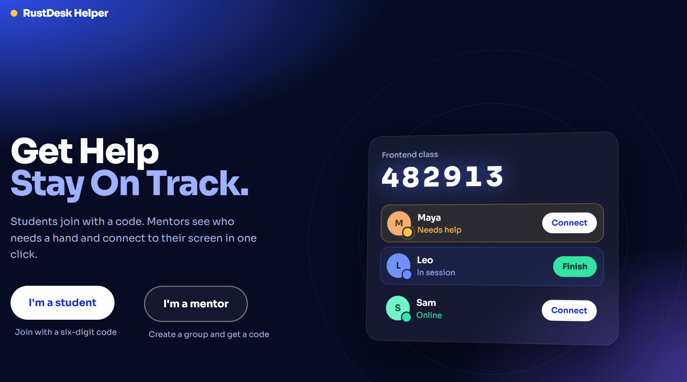
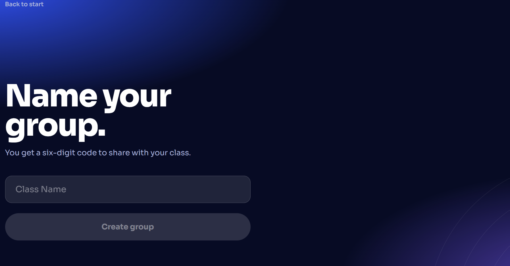
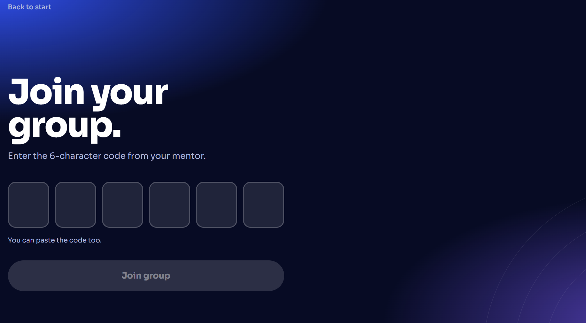
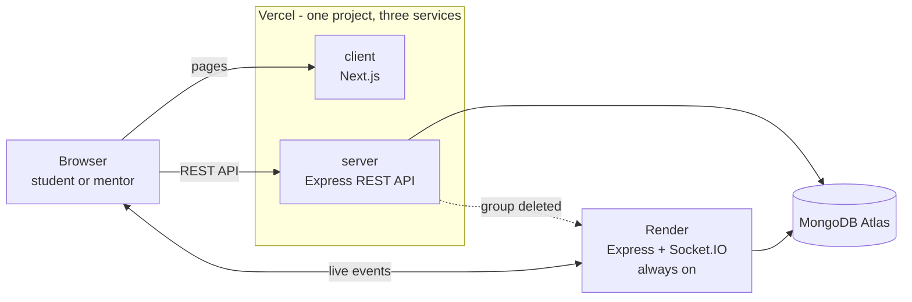
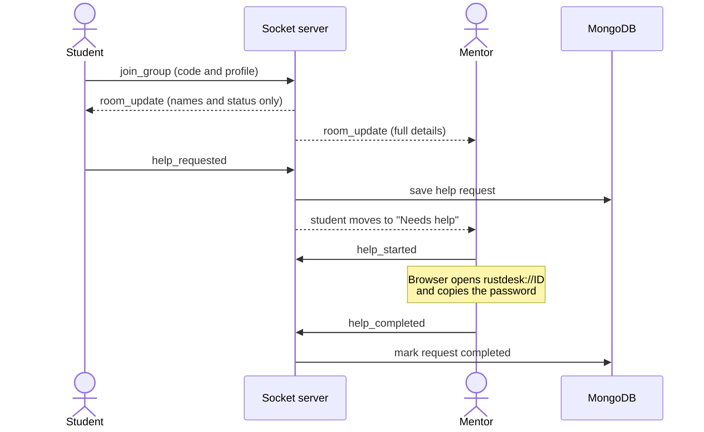

# 🖥️ RustDesk Helper

**Remote help for classrooms. Students ask, mentors connect.**


[**Live demo**](https://rustdesk-helper-kf61.vercel.app) · [How it works](#how-it-works) · [Run it locally](#run-it-locally) · [Deploy](#deployment)

</div>

> The live demo's socket server sleeps when nobody is using it (free hosting), so the first connection after a break can take up to a minute.

---

## ❓ What is it?

rustdesk-helper is a small web app for classes and workshops where people help each other over [RustDesk](https://rustdesk.com), an open-source remote desktop tool.

Students join a group with a code and raise a hand when they are stuck. The mentor sees a live list, with the students who need help at the top, and connects to a student's screen with one click.

No accounts are needed for students or mentors.

<p align="center">
  
  &nbsp;&nbsp;&nbsp;
  
  &nbsp;&nbsp;&nbsp;
  
</p>
## How it works

There are two roles. Everyone starts at the home page.

### Students

1. Choose **I'm a student**.
2. Enter the 6-character **group code** from your mentor.
3. Fill in your **profile**: name, RustDesk ID, RustDesk password, and an optional photo. It is saved in your browser, so you only do it once.
4. Join the group. When you need help, press the help button. You move to the top of the mentor's list.
5. The mentor connects through RustDesk. When they finish, your status goes back to normal.

### Mentors

1. Choose **I'm a mentor** and give your group a name. You get a six-digit **group code**.
2. Share the code, or press **Copy invite** to copy a ready-to-send message with the link.
3. Students appear live. Anyone who needs help is shown first, with a pulsing dot. You can turn on a soft **sound alert**, and the browser tab title shows how many students are waiting.
4. Press **Connect**. The student's RustDesk password is copied and RustDesk opens on their ID. Use **Reopen** if it didn't launch, and **Finish** when you are done.
5. **Delete group and log out** removes your group, and any student still inside is sent back to the code page.

A mentor can have one group at a time. There is no sign-up: your browser holds a secret key that proves the group is yours.

## ✨ Features

- Live student list that updates without refreshing (Socket.IO)
- Help queue with priority: needs help, then in session, then online
- One-click remote connect through the `rustdesk://` link, with the password copied for you
- Group codes for students and one-group-per-mentor ownership with no accounts
- Groups deleted by a mentor immediately send their students out
- Responsive and keyboard friendly, with reduced-motion support

## 🏗️ Architecture



**Why two hosts for the server?** Vercel runs the API as serverless functions, which start per request and cannot keep a connection open. That is perfect for normal API calls, but Socket.IO needs a connection that stays up. So the same Express code also runs on Render as a normal always-on process, and the browser connects to it for live events. A small `isVercel` flag decides what each copy does: Vercel serves REST only, Render serves REST and sockets.

Vercel's **Services** feature lets `client` and `server` live in one monorepo and one project, with rewrites choosing which service answers a path.

### The help flow



## 🔒 Security Model

The project has no user accounts for students and mentors, so access is built on secrets instead.

| Concern                                             | How it is handled                                                                                                                                       |
| --------------------------------------------------- | ------------------------------------------------------------------------------------------------------------------------------------------------------- |
| Students must not see each other's RustDesk details | The server sends students a trimmed list (name, photo, status). Only staff sockets receive IDs and passwords.                                           |
| Mentor identity without accounts                    | Creating a group returns a random 256-bit **owner key**. Only its SHA-256 hash is stored. The mentor's browser presents the key to prove ownership.     |
| Admin identity on the socket server                 | The admin login cookie does not reach the other domain, so the API issues a 5-minute signed token that the socket server verifies with a shared secret. |
| Admin-only REST routes                              | `protectAdmin` middleware (JWT in an HTTP cookie).                                                                                                      |
| Deleting a group                                    | The Vercel API sends a signed server-to-server request to Render, which closes the rooms and sends students out.                                        |
| Input from sockets                                  | Payloads are whitelisted and length-limited, so a client cannot inject fields into its own record.                                                      |
| Browser protections                                 | Helmet, a CORS allowlist, and `timingSafeEqual` for key comparison.                                                                                     |

## Tech stack

| Area      | Tools                                                                           |
| --------- | ------------------------------------------------------------------------------- |
| Front end | Next.js (App Router), React, Tailwind CSS, TanStack Query, react-hot-toast      |
| Back end  | Node.js, Express 5, Socket.IO, Mongoose, Zod, JSON Web Tokens, bcryptjs, Helmet |
| Database  | MongoDB Atlas                                                                   |
| Hosting   | Vercel (client, admin, REST API) and Render (Socket.IO server)                  |
|           |

## 📁 Project Structure

```
rustdesk-helper/
├── client/                  Student and mentor site (Next.js)
│   ├── app/                 Pages: home, student, profile, group, mentor
│   ├── features/mentor/     Mentor pages, API calls and local storage
│   └── lib/                 Socket client, fonts, helpers
├── admin/                   Admin panel (Next.js, served under /admin)
│   ├── app/dashboard/       Overview, groups, categories, contact
│   └── features/            Feature-based folders (dashboard, group, ...)
├── server/                  Express API and Socket.IO server
│   └── src/
│       ├── server.js        App setup, middleware, routes
│       ├── socket.js        Live rooms, help requests, staff checks
│       ├── modules/         auth, group, category, contact, dashboard
│       ├── config/          Database connection, Swagger
│       └── scripts/         Admin seeding
└── vercel.json              Services and rewrites
```

## Run it locally

**You need:** Node.js 20 or newer, and a MongoDB database (a free MongoDB Atlas cluster works).

### 1. Install

```bash
git clone https://github.com/<your-username>/rustdesk-helper.git
cd rustdesk-helper

cd server && npm install && cd ..
cd client && npm install && cd ..
cd admin  && npm install && cd ..
```

### 2. Configure the server

Create `server/.env`:

```env
PORT=5000
MONGO_URI=mongodb+srv://<user>:<password>@<cluster>/<database>
CLIENT_URL=http://localhost:3000
ADMIN_URL=http://localhost:3001
SOCKET_JWT_SECRET=<a long random string>

# Auth and the first admin account (use the names your code reads)
JWT_SECRET=<a long random string>
```

<!-- TODO: replace JWT_SECRET, ADMIN_EMAIL and ADMIN_PASSWORD with the exact variable names read in server/src (search for process.env). -->

Generate a random secret with:

```bash
node -e "console.log(require('crypto').randomBytes(32).toString('hex'))"
```

The frontends need no `.env` file locally. They default to `http://localhost:5000`.

### 3. Start everything

Use three terminals:

```bash
# Terminal 1: API and sockets on http://localhost:5000
cd server && npm run dev

# Terminal 2: student and mentor site on http://localhost:3000
cd client && npm run dev

# Terminal 3: admin panel on http://localhost:3001/admin
cd admin && npm run dev -- -p 3001
```

The admin account is created on first start. To create it manually, run `npm run seed:admin` in `server`.

### 4. Try the flow

1. Open `http://localhost:3000` and choose **I'm a mentor**. Create a group.
2. In a private window, choose **I'm a student**, enter the code, fill in the profile (fake data is fine) and join.
3. Press the help button as the student and watch the mentor's list react.

To test the real connection you need RustDesk installed on both computers.

🔌 API and Socket Reference

<details>
<summary><b>REST endpoints</b></summary>

<br />

| Method and path                   | Access                                  | Purpose                                                             |
| --------------------------------- | --------------------------------------- | ------------------------------------------------------------------- |
| `POST /api/groups/check`          | Public                                  | Check that a group code exists                                      |
| `POST /api/groups/mentor`         | Public                                  | Create a mentor's group (one per browser) and receive the owner key |
| `DELETE /api/groups/mentor/me`    | Owner key (`Authorization: Bearer ...`) | Delete the mentor's own group                                       |
| `GET /api/groups`                 | Admin                                   | List all groups                                                     |
| `POST /api/groups`                | Admin                                   | Create a group                                                      |
| `DELETE /api/groups/:id`          | Admin                                   | Delete any group                                                    |
| `GET /api/dashboard/stats`        | Admin                                   | Totals, requests per day, recent help requests                      |
| `GET /api/dashboard/socket-token` | Admin                                   | Short-lived token for the socket server                             |
| `/api/auth`                       | Mixed                                   | Sign in, current user, sign out                                     |
| `/api/category`, `/api/contact`   | Mixed                                   | Categories and contacts                                             |
| `GET /api/docs`                   | Public                                  | Swagger UI                                                          |

</details>

<details>
<summary><b>Socket events</b></summary>

<br />

**Client to server**

| Event                            | Sent by       | Purpose                                            |
| -------------------------------- | ------------- | -------------------------------------------------- |
| `join_group`                     | Student       | Join a group with a profile                        |
| `student_updated`                | Student       | Update profile details                             |
| `help_requested`                 | Student       | Ask for help                                       |
| `admin_join_group`               | Mentor, admin | Watch a group (needs owner key or admin token)     |
| `admin_join_dashboard`           | Admin         | Receive live dashboard numbers (needs admin token) |
| `help_started`, `help_completed` | Mentor, admin | Start or finish helping a student                  |

**Server to client**

| Event                            | Sent to             | Purpose                                             |
| -------------------------------- | ------------------- | --------------------------------------------------- |
| `room_update`                    | Everyone in a group | Student list (trimmed for students, full for staff) |
| `dashboard_update`               | Admins              | Live totals                                         |
| `help_started`, `help_completed` | One student         | Their session changed                               |
| `group_closed`                   | Students            | The group was deleted                               |
| `join_denied`, `staff_denied`    | One socket          | Unknown group or failed staff check                 |

</details>

## ⚠️ Known Limitations

This is a portfolio project, so a few trade-offs are deliberate:

- **Mentors have no accounts.** The one-group limit relies on an ID kept in the browser, so clearing the browser's storage lets someone create another group.
- **Group codes are not secret.** Six characters can be guessed, so anyone who finds a code can join as a student. Student details are hidden from other students, and only the group's mentor and admins see them.
- **Live state lives in server memory.** If the socket server restarts or sleeps, students reconnect and reappear, but anything in progress is lost. Saved history (counts, recent requests) lives in MongoDB.
- **RustDesk passwords are not stored in the database.** They stay in the student's browser and are sent to the group's mentor and admins over HTTPS and WSS.
- **Free hosting sleeps.** The first connection after a long idle period is slow.
- **Scheduled jobs.** `node-cron` only runs where a process stays alive (locally and on Render).
- **History starts when the dashboard feature was added.** Earlier sessions were not saved.

## 🦺 Troubleshooting

- **"Key mismatch" in RustDesk.** Both computers must use the same RustDesk server settings, including the **Key** (RustDesk → menu → Network).
- **The Connect button does nothing.** Allow the browser to open RustDesk links when it asks, and make sure the regular (installed) RustDesk is on that computer, since portable builds may not register the `rustdesk://` link.
- **The list stays empty or says "Reconnecting".** The socket server may be waking up. Wait up to a minute.
- **A `localhost` address shows up in production.** The `NEXT_PUBLIC_` variables were missing at build time. Add them and redeploy.

## 🛠️ Fixes

- **CronJob added** to keep the server awake and prevent it from sleeping due to inactivity.
